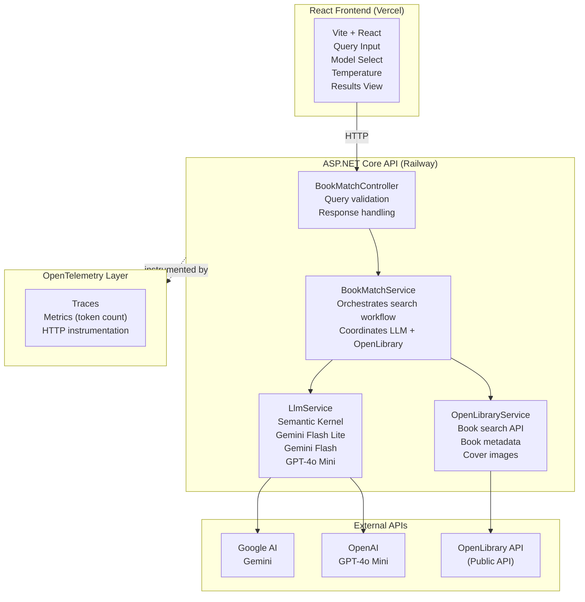
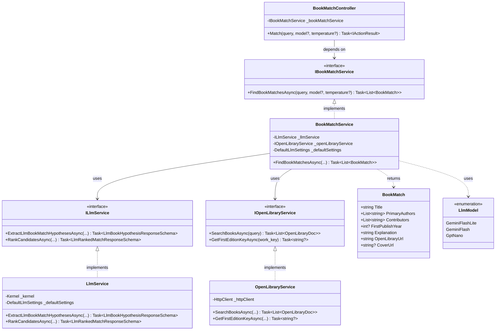

# BookMatcher

A fuzzy book search system that uses large language models to interpret messy, incomplete queries and match them to real books from the OpenLibrary API.

**Live Demo:** https://book-matcher-rosy.vercel.app

**API Endpoint:** https://bookmatcher-production.up.railway.app

## Quick Start

### Prerequisites

- **Option 1 (Docker):** Docker Desktop installed
- **Option 2 (.NET):** .NET 10 SDK installed

### Setup and Run

Run the setup script:

```bash
./start.sh
```

The script will:
- Prompt you for API keys (Gemini and OpenAI)
- Let you choose between Docker or .NET CLI
- Start the server at `http://localhost:5000`

## Architecture Overview

### System Architecture



### Class Diagram



## How It Works

### Multi-Stage Fuzzy Matching

BookMatcher uses a two-stage approach to find books:

1. **LLM Processing Stage**
   - Takes user's messy query (e.g., "there and back again")
   - Uses LLM to extract structured information:
     - Potential titles
     - Likely authors
     - Search terms for OpenLibrary
   - Generates multiple search strategies

2. **OpenLibrary Search Stage**
   - Executes standard searches against OpenLibrary API using LLM-generated terms
   - Retrieves candidate books with metadata
   - Fetches cover images and publication details

3. **LLM Ranking Stage**
   - LLM evaluates candidates against original query
   - Generates explanations for each match
   - Returns ranked results with confidence scores

### Example Query Flow

```
User Query: "there and back again"
    |
    v
┌────────────────────────────────────────┐
│ LLM: "This refers to 'The Hobbit'      │
│      by J.R.R. Tolkien.                │
│      Search terms: ['hobbit',          │
│      'tolkien', 'there and back']"     │
└────────────────┬───────────────────────┘
                 │
                 v
┌────────────────────────────────────────┐
│ OpenLibrary API searches:              │
│  - "hobbit tolkien"                    │
│  - "there and back again"              │
│  Returns: [15 candidate books]         │
└────────────────┬───────────────────────┘
                 │
                 v
┌────────────────────────────────────────┐
│ LLM ranks and filters:                 │
│  1. The Hobbit (1937)                  │
│     "Exact match - original subtitle   │
│      'There and Back Again'"           │
│  2. The Hobbit (2012 edition)          │
│     "Same book, different edition"     │
└────────────────────────────────────────┘
```

## Technology Stack

### Backend
- **.NET 10** - Modern, high-performance web framework
- **ASP.NET Core Web API** - RESTful API implementation
- **Microsoft Semantic Kernel 1.68.0** - LLM orchestration framework
- **Polly** - Resilience and retry policies for HTTP clients
- **OpenTelemetry** - Distributed tracing and metrics

### Frontend
- **React 18** - UI framework
- **Vite** - Build tool and dev server
- **CSS3** - Styling with gradients and animations

### LLM Providers
- **Google Gemini 2.5 Flash Lite** - Fast, efficient model (default)
- **Google Gemini 2.5 Flash** - Balanced performance
- **OpenAI GPT-4o Mini** - Alternative model option

### External Services
- **OpenLibrary API** - Book metadata and cover images

### Infrastructure
- **Docker** - Containerization
- **Railway** - Backend hosting
- **Vercel** - Frontend hosting

## Project Structure

```
BookMatcher/
├── BookMatcher.Api/              # Web API project
│   ├── Controllers/              # API endpoints
│   ├── Program.cs                # App configuration
│   └── appsettings.json          # Configuration (API keys go here)
│
├── BookMatcher.Services/         # Business logic
│   ├── BookMatchService.cs       # Orchestration service
│   ├── LlmService.cs             # LLM interaction
│   ├── OpenLibraryService.cs     # OpenLibrary API client
│   └── Interfaces/               # Service contracts
│
├── BookMatcher.Common/           # Shared models
│   ├── Models/                   # DTOs and domain models
│   └── Exceptions/               # Custom exception types
│
├── BookMatcher.Tests/            # Unit tests
│   └── Services/                 # Service layer tests
│
├── BookMatcher.Web/              # React frontend
│   ├── src/
│   │   ├── App.jsx               # Main component
│   │   ├── App.css               # Styles
│   │   └── main.jsx              # Entry point
│   ├── index.html                # HTML shell
│   └── vite.config.js            # Vite configuration
│
├── Dockerfile                    # Multi-stage Docker build
├── docker-compose.yml            # Local Docker setup
└── start.sh                      # Setup and run script
```

## API Reference

### Endpoint

```
GET /api/bookMatch/match
```

### Query Parameters

| Parameter | Type | Required | Default | Description |
|-----------|------|----------|---------|-------------|
| query | string | Yes | - | Natural language book query |
| model | int | No | 0 | LLM model (0=Gemini Flash Lite, 1=Gemini Flash, 2=GPT-4o Mini) |
| temperature | float | No | 0.7 | LLM creativity (0.0-1.0) |

### Response Format

```json
{
  "matches": [
    {
      "title": "The Hobbit",
      "primary_authors": ["J.R.R. Tolkien"],
      "contributors": [],
      "first_publish_year": 1937,
      "explanation": "This is an exact match. The subtitle of The Hobbit is 'There and Back Again'",
      "openlibrary_url": "https://openlibrary.org/works/OL262758W",
      "cover_url": "https://covers.openlibrary.org/b/id/12345-L.jpg"
    }
  ]
}
```

### Error Responses

| Status Code | Meaning |
|-------------|---------|
| 400 | Invalid query parameters |
| 404 | No matches found |
| 503 | LLM or OpenLibrary service unavailable |
| 500 | Unexpected server error |

### Example Requests

```bash
# Basic search
curl "http://localhost:5000/api/bookMatch/match?query=there%20and%20back%20again"

# With specific model
curl "http://localhost:5000/api/bookMatch/match?query=wizard%20school&model=2"

# With custom temperature
curl "http://localhost:5000/api/bookMatch/match?query=fellowship%20ring&temperature=0.5"
```

## Design Decisions

### Why Semantic Kernel?

Microsoft Semantic Kernel provides a clean abstraction over multiple LLM providers, allowing easy model switching and prompt management. This makes the system flexible and future-proof as new models become available.

### Why Multiple LLM Models?

Different models have different strengths:
- **Gemini Flash Lite:** Fast and cost-effective for high-volume queries
- **Gemini Flash:** Better accuracy for complex queries
- **GPT-4o Mini:** Alternative when Gemini is unavailable or for comparison

### Why Two-Stage Matching?

1. **First stage (LLM):** Interprets messy input and generates structured search terms
2. **Second stage (OpenLibrary):** Standard API search using LLM-generated terms across large book database
3. **Third stage (LLM):** Ranks results and provides human-readable explanations

This approach combines LLM reasoning with real book data, avoiding hallucination while maintaining flexibility. The "fuzzy" part comes from the LLM's interpretation, not OpenLibrary's API.

### Error Handling Strategy

Custom exception types (LlmServiceException, OpenLibraryServiceException) allow specific HTTP status codes:
- 503 for service unavailability (retryable)
- 404 for no matches (expected behavior)
- 500 for unexpected errors (logging required)

### Configuration Management

Single `appsettings.json` file simplifies deployment:
- Local development: Real keys in file (user provides them)
- Docker: Mounted as volume
- Production: Environment variables override file values

## Observability

OpenTelemetry instrumentation provides:
- **Request tracing:** End-to-end visibility of API calls
- **Token metrics:** LLM usage tracking for cost management
- **HTTP instrumentation:** Detailed logging of OpenLibrary API calls
- **Console export:** Easy debugging during development

Example trace output:
```
Activity.TraceId:            abc123...
Activity.SpanId:             def456...
Activity.ActivitySourceName: Microsoft.SemanticKernel
gen_ai.response.model:       gemini-2.5-flash-lite
gen_ai.usage.input_tokens:   150
gen_ai.usage.output_tokens:  320
```

## Testing Strategy

### Unit Tests

Located in `BookMatcher.Tests/Services/`:
- **OpenLibraryServiceTests:** API deserialization and error handling
- **LlmServiceTests:** Prompt generation and response parsing
- **BookMatchServiceTests:** End-to-end workflow orchestration

Run tests:
```bash
dotnet test
```

### Integration Tests

Manual verification checklist:
- Demo queries return relevant results
- Model switching works correctly
- Temperature control affects results
- Error handling returns appropriate status codes
- CORS allows frontend requests
- OpenTelemetry logs appear in console

## Known Limitations

1. **OpenLibrary API Rate Limits:** No explicit rate limiting implemented (relies on Polly retry)
2. **Cost Management:** No token usage caps or budget alerts
3. **Caching:** No result caching (every query hits LLM and OpenLibrary)
4. **Authentication:** No API key required (open endpoint)
5. **Input Validation:** Basic validation only (no profanity filter, etc.)

## Future Improvements

### Short Term
- Add result caching (Redis)
- Implement request rate limiting
- Add more comprehensive unit tests
- Add integration tests with mocked LLM responses
- Improve error messages with retry suggestions

### Medium Term
- Add user authentication
- Implement search history
- Add favorite/bookmark functionality
- Support pagination for large result sets
- Add more LLM models (Claude, Llama)

### Long Term
- Implement semantic caching (similar queries reuse results)
- Add recommendation engine based on search patterns
- Support multiple book databases (Goodreads, Google Books)
- Build mobile app
- Add multi-language support

## Deployment

### Local Development
```bash
./start.sh
```

### Docker
```bash
docker-compose up --build
```

### Demo Live Deployment
Backend:
Railway auto-deploys from GitHub `main` branch

Frontend: Vercel auto-deploys from GitHub `main` branch